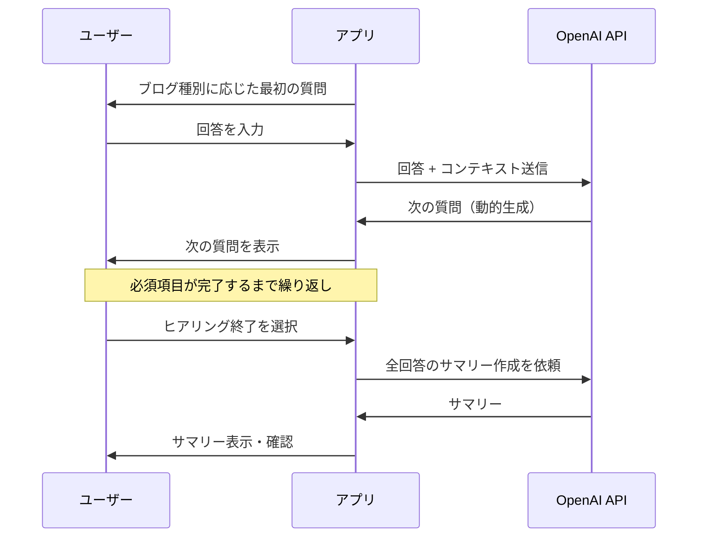
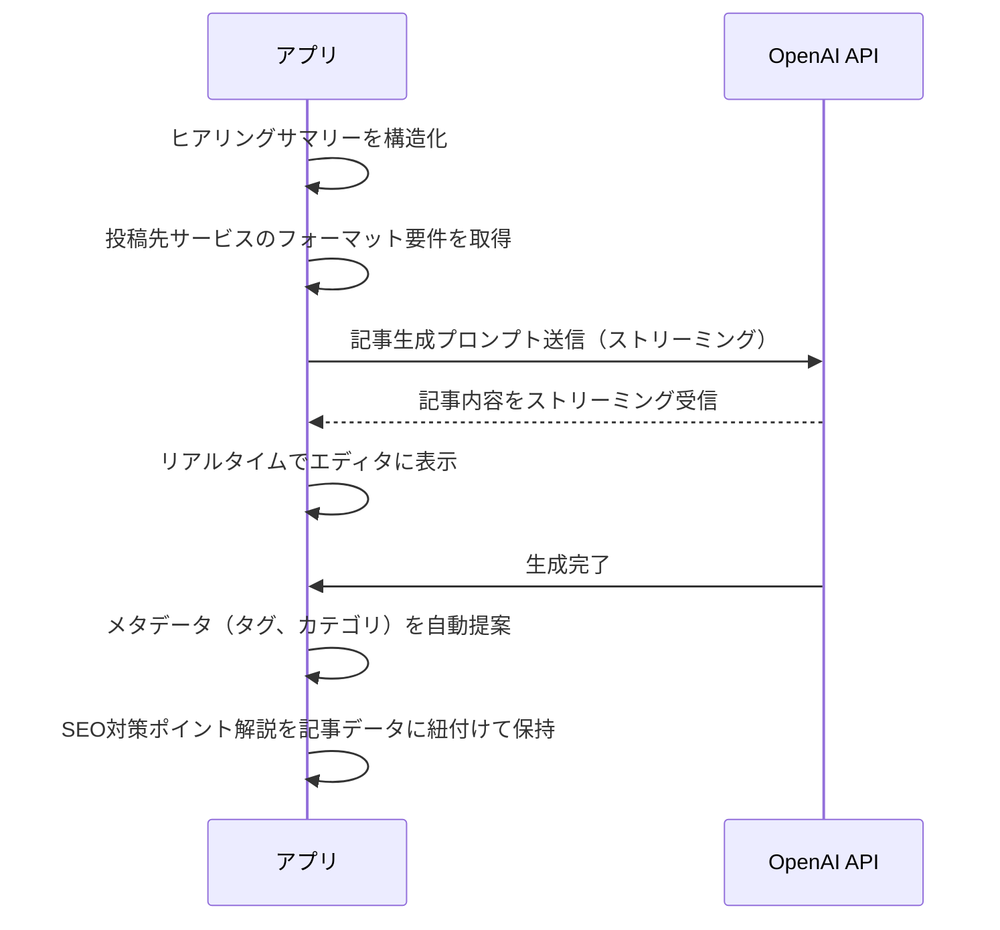
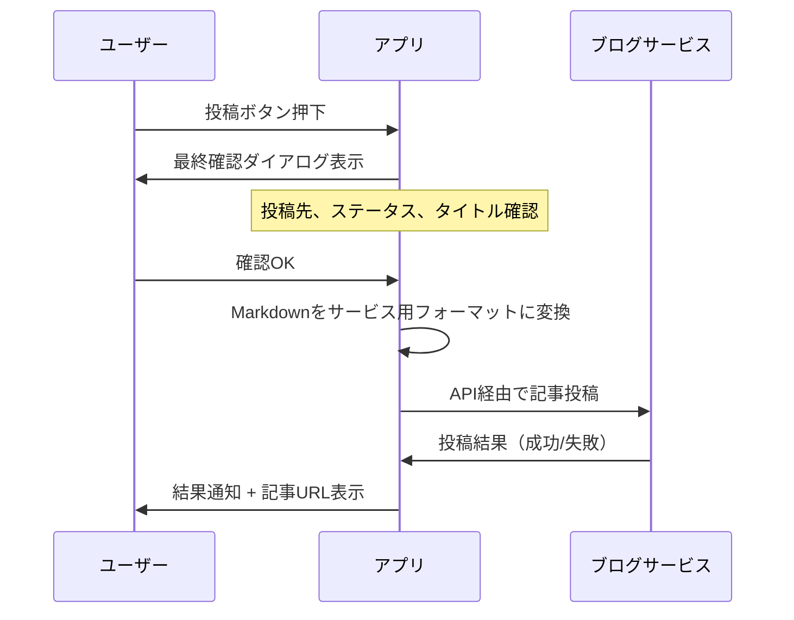

# 機能仕様書

| 項目 | 内容 |
|------|------|
| プロジェクト名 | PostBlog - 高速ブログ投稿支援アプリ |
| バージョン | 1.0.0 |
| 作成日 | 2026-02-19 |
| 最終更新日 | 2026-02-19 |

---

## 1. 機能概要図

```
┌─────────────────────────────────────────────────────────┐
│                    PostBlog アプリケーション                │
├─────────────────────────────────────────────────────────┤
│                                                         │
│  ┌──────────┐  ┌──────────┐  ┌──────────┐  ┌────────┐ │
│  │ サービス  │→│ ヒアリング │→│ 記事生成  │→│ 記事   │ │
│  │ 連携設定  │  │          │  │          │  │ 編集   │ │
│  └──────────┘  └──────────┘  └──────────┘  └────────┘ │
│       ↑              ↑             ↑            │      │
│       │              │             │            ↓      │
│  ┌──────────┐  ┌──────────┐  ┌──────────┐  ┌────────┐ │
│  │ 認証管理  │  │ ブログ   │  │ OpenAI   │  │ 記事   │ │
│  │          │  │ 種別管理  │  │ API連携  │  │ 投稿   │ │
│  └──────────┘  └──────────┘  └──────────┘  └────────┘ │
│                                                         │
└─────────────────────────────────────────────────────────┘
```

---

## 2. F-001: サービス連携認証

### 2.1 機能説明

各ブログサービスのAPI認証情報を安全に管理し、記事の投稿を可能にする。認証情報はOS標準のキーチェーンに保存する。

### 2.2 認証フロー

#### Qiita（APIトークン方式）

```
1. ユーザーがQiitaの設定画面で個人用アクセストークンを発行
2. アプリの設定画面でトークンを入力
3. アプリがQiita API (GET /api/v2/authenticated_user) で疎通確認
4. 成功時、トークンをkeyringに保存
```

#### Zenn（GitHub連携方式）

```
1. ユーザーがGitHubで記事管理用リポジトリを作成（zenn-cli形式）
2. アプリの設定画面でGitHubトークンとリポジトリ情報を入力
3. アプリがGitHub API でリポジトリへのアクセスを確認
4. 成功時、トークンとリポジトリ情報をkeyringに保存
```

#### WordPress（Application Passwords方式）

```
1. ユーザーがWordPress管理画面でApplication Passwordを生成
2. アプリの設定画面でサイトURL、ユーザー名、Application Passwordを入力
3. アプリがREST API (GET /wp-json/wp/v2/users/me) で疎通確認
4. 成功時、認証情報をkeyringに保存
```

#### はてなブログ（WSSE認証方式）

```
1. ユーザーがはてなのAPIキーを取得
2. アプリの設定画面ではてなID、ブログID、APIキーを入力
3. アプリがAtomPub APIで疎通確認
4. 成功時、認証情報をkeyringに保存
```

#### Ameba Blog（メール投稿方式）

```
1. ユーザーがAmeba Blogの管理画面でメール投稿設定を有効化
   - マイページ → 設定・管理 → メール投稿
2. 送信元メールアドレスを登録し、専用の投稿先メールアドレスを取得
3. アプリの設定画面で以下を入力:
   - 送信元メールアドレス
   - 投稿先メールアドレス（Ameba側で発行されたアドレス）
4. アプリがテストメール送信で疎通確認
5. 成功時、設定情報をkeyringに保存
```

### 2.3 認証情報の保存仕様

| 項目 | 仕様 |
|------|------|
| 保存先 | keyring（OS標準キーチェーン） |
| サービス名 | `postblog_{service_name}` |
| キー形式 | `{service_name}_{credential_type}` |
| フォールバック | keyring非対応環境はAES-256暗号化ファイル |

### 2.4 接続状態管理

| 状態 | 表示 | 説明 |
|------|------|------|
| 未設定 | グレー | 認証情報が未登録 |
| 接続済 | 緑 | 認証済みでAPI疎通確認済み |
| 認証エラー | 赤 | トークン無効または期限切れ |
| 接続不可 | 黄 | ネットワーク未接続 |

---

## 3. F-002: ブログ種別選択

### 3.1 機能説明

作成するブログ記事の種別を選択し、以降のヒアリング内容を決定する。種別に応じてLLMへのシステムプロンプトとヒアリング項目が切り替わる。

### 3.2 ブログ種別定義

#### 種別一覧

| ID | 種別名 | ヒアリング方針 | アイコン |
|----|--------|--------------|---------|
| tech | 技術ブログ | 事実ベース（技術的正確性重視） | コード |
| diary | 日記・エッセイ | 思い・感情ベース（共感性重視） | ペン |
| review | レビュー・書評 | 評価・分析ベース（客観性重視） | 星 |
| news | ニュース・時事 | 情報整理ベース（速報性重視） | 新聞 |
| howto | ハウツー | 手順ベース（再現性重視） | リスト |

#### 種別ごとのヒアリング項目

**tech（技術ブログ）**

| 順序 | ヒアリング項目 | 必須 | 説明 |
|------|--------------|------|------|
| 1 | 技術テーマ | 必須 | 何の技術について書くか |
| 2 | 背景・動機 | 必須 | なぜその技術を使ったか |
| 3 | 課題・問題点 | 必須 | 何が問題だったか |
| 4 | 解決方法 | 必須 | どう解決したか |
| 5 | コード例 | 任意 | 具体的なコードがあれば |
| 6 | 結果・成果 | 必須 | 結果はどうだったか |
| 7 | 注意点・ハマりポイント | 任意 | 気をつけるべき点 |
| 8 | まとめ・今後 | 任意 | 今後の展望 |

**diary（日記・エッセイ）**

| 順序 | ヒアリング項目 | 必須 | 説明 |
|------|--------------|------|------|
| 1 | テーマ・タイトル案 | 必須 | 何について書きたいか |
| 2 | きっかけ・出来事 | 必須 | 書くきっかけとなった出来事 |
| 3 | その時の気持ち | 必須 | どう感じたか |
| 4 | 考えたこと | 必須 | 何を考えたか |
| 5 | 学び・気づき | 任意 | 得られた学びや気づき |
| 6 | 読者へのメッセージ | 任意 | 伝えたいこと |

**review（レビュー・書評）**

| 順序 | ヒアリング項目 | 必須 | 説明 |
|------|--------------|------|------|
| 1 | レビュー対象 | 必須 | 何をレビューするか |
| 2 | 概要・あらすじ | 必須 | 対象の概要 |
| 3 | 良かった点 | 必須 | ポジティブな評価 |
| 4 | 気になった点 | 任意 | ネガティブな評価 |
| 5 | 印象的な部分 | 任意 | 特に印象に残った点 |
| 6 | 総合評価 | 必須 | おすすめ度と理由 |
| 7 | 対象読者 | 任意 | どんな人におすすめか |

**news（ニュース・時事）**

| 順序 | ヒアリング項目 | 必須 | 説明 |
|------|--------------|------|------|
| 1 | トピック | 必須 | 何のニュースか |
| 2 | 事実・概要 | 必須 | 何が起きたか |
| 3 | 背景 | 必須 | なぜ起きたか |
| 4 | 影響・論点 | 必須 | どんな影響があるか |
| 5 | 自分の見解 | 必須 | 自分はどう考えるか |
| 6 | 参考情報・ソース | 任意 | 参考にした情報源 |

**howto（ハウツー・チュートリアル）**

| 順序 | ヒアリング項目 | 必須 | 説明 |
|------|--------------|------|------|
| 1 | 目的・ゴール | 必須 | 何を達成するチュートリアルか |
| 2 | 対象読者 | 必須 | どんなレベルの人向けか |
| 3 | 前提条件 | 必須 | 必要な知識や環境 |
| 4 | 手順 | 必須 | ステップバイステップの手順 |
| 5 | 各手順の補足 | 任意 | 注意点やTips |
| 6 | 完成イメージ | 必須 | 最終的にどうなるか |
| 7 | トラブルシューティング | 任意 | よくある問題と対処法 |

### 3.3 種別データ構造

```python
@dataclass
class BlogType:
    id: str                          # 種別ID（例: "tech"）
    name: str                        # 表示名（例: "技術ブログ"）
    description: str                 # 説明文
    hearing_policy: str              # ヒアリング方針
    hearing_items: list[HearingItem] # ヒアリング項目リスト
    system_prompt: str               # LLMシステムプロンプト
    article_template: str            # 記事テンプレート

@dataclass
class HearingItem:
    order: int          # 表示順序
    key: str            # 項目キー
    question: str       # 質問文
    required: bool      # 必須フラグ
    description: str    # ヒント文
```

---

## 4. F-003: チャット形式ヒアリング

### 4.1 機能説明

選択されたブログ種別に基づいて、チャットUI上でユーザーからブログの素材となる情報を対話的に収集する。ヒアリング項目はベースとして定義されるが、LLMがユーザーの回答に応じて質問を動的に調整する。

### 4.2 ヒアリングフロー



### 4.3 LLM連携仕様

#### ヒアリング用システムプロンプト構成

```
[共通指示]
あなたはブログ記事作成のためのインタビュアーです。
ユーザーから情報を引き出し、良いブログ記事の素材を集めてください。

[種別固有指示]
{blog_type.system_prompt}

[ヒアリング項目]
以下の項目について順番にヒアリングしてください。
ただし、ユーザーの回答に応じて質問を自然に調整してください。
{hearing_items}

[SEOヒアリング（全種別共通）]
コンテンツのヒアリングが一通り完了したら、以下のSEO関連項目を確認してください。
- ターゲットキーワード: この記事で検索上位を狙いたいキーワードは何か
- 想定読者: どんな人に読んでほしいか（例: 初心者エンジニア、経営者）
- 検索意図: 読者はどんな課題・疑問を持って検索するか
※ ユーザーがSEOに詳しくない場合は、記事内容から適切なキーワードを提案する

[制約]
- 1回の質問は1つのトピックに絞る
- ユーザーの回答が不十分な場合は深掘り質問を行う
- 必須項目は必ず確認する
- 自然な会話の流れを維持する
- SEOヒアリングは押し付けにならない自然な形で行う
```

#### LLMリクエスト仕様

| 項目 | 値 |
|------|-----|
| モデル | gpt-4o |
| temperature | 0.7 |
| max_tokens | 500（1回の応答あたり） |
| ストリーミング | 有効 |

#### メッセージ履歴管理

- 全チャット履歴をコンテキストとして送信
- トークン数が上限に近づいた場合、古い会話をサマリー化

### 4.4 ヒアリング終了条件

| 条件 | 動作 |
|------|------|
| 必須項目すべて完了 | 「記事生成へ進む」ボタンを活性化 |
| ユーザーが終了を選択 | 未完了の必須項目があれば警告表示 |
| ヒアリング質問数が上限到達 | 自動的にサマリーフェーズへ移行 |

### 4.5 サマリー機能

ヒアリング完了時に、収集した情報のサマリーを表示する。

```
【ヒアリングサマリー】
■ テーマ: Docker Composeによるローカル開発環境構築
■ 背景: 開発チームの環境差異による不具合が頻発
■ 課題: 各開発者のローカル環境が統一されていない
■ 解決策: Docker Composeで環境を統一
■ 結果: 環境差異による不具合が90%減少
■ 注意点: メモリ使用量に注意が必要

【SEO情報】
■ ターゲットキーワード: Docker Compose 開発環境
■ 想定読者: チーム開発を行うエンジニア
■ 検索意図: Docker Composeでの環境構築手順を知りたい

→ この内容で記事を生成しますか？ [生成する] [修正する]
```

---

## 5. F-004: 記事プロトタイプ生成

### 5.1 機能説明

ヒアリングで収集した情報をもとに、OpenAI APIを使用してブログ記事のプロトタイプをMarkdown形式で生成する。

### 5.2 生成フロー



### 5.3 記事生成プロンプト構成

```
[システムプロンプト]
あなたはSEOに精通したプロのブログライターです。
以下のヒアリング結果をもとに、{blog_type}の記事を作成してください。

[フォーマット指示]
- Markdown形式で出力
- 投稿先: {service_name}
- 記事構成: タイトル、導入、本文、まとめ
- 文体: {blog_type.tone}（例: 技術的・簡潔/親しみやすい/分析的）

[ヒアリング結果]
{hearing_summary}

[SEO情報]
- ターゲットキーワード: {target_keywords}
- 想定読者: {target_audience}
- 検索意図: {search_intent}

[SEO最適化指示]
以下のSEOベストプラクティスに従って記事を生成すること:
1. タイトル: ターゲットキーワードを含め、30〜60文字で読者の興味を引く
2. 見出し構造: H1（タイトル）→ H2 → H3 の適切な階層を維持
3. キーワード配置: ターゲットキーワードを以下に自然に含める
   - 記事タイトル（H1）
   - 最初の段落（導入文の100文字以内）
   - H2見出しの少なくとも1つ
   - 本文中に自然な頻度で（目安: 2〜5%の出現率）
   - まとめ・結論セクション
4. 関連キーワード: ターゲットキーワードの関連語・共起語を本文に含める
5. メタディスクリプション: 記事末尾に120〜160文字の要約を生成
6. 導入文: 読者の課題を明示し、記事を読むメリットを最初に伝える
7. 本文構成: 1段落3〜4文、適切な長さの段落で読みやすくする
8. CTA: 記事末尾に読者の次のアクションを促す一文を含める

[SEO対策ポイント解説の出力指示]
記事本文の生成後、以下の形式でSEO対策ポイント解説を出力すること:
- 記事に適用した各SEO施策について「施策内容」と「その理由・効果」を説明する
- カテゴリ別（タイトル、見出し構造、キーワード配置、本文構成、メタ情報）に整理する
- ユーザーが記事を編集する際の注意点を具体的に記載する
- SEO初心者にもわかりやすい平易な表現で説明する
- 各ポイントは箇条書き形式で簡潔にまとめる

[追加指示]
- 読者にとって価値のある内容にする
- 適切な見出し構成にする
- コードブロックがある場合は言語指定する
- キーワードの詰め込み（キーワードスタッフィング）は避ける
```

#### LLMリクエスト仕様

| 項目 | 値 |
|------|-----|
| モデル | gpt-4o |
| temperature | 0.5 |
| max_tokens | 4000 |
| ストリーミング | 有効 |

### 5.4 生成後のメタデータ提案

記事生成後、投稿先サービスに必要なメタデータを自動提案する。

| メタデータ | 生成方法 |
|-----------|---------|
| タイトル | ターゲットキーワードを含むSEO最適化タイトルを自動生成 |
| タグ/トピック | 記事内容とターゲットキーワードからLLMが提案 |
| メタディスクリプション | 120〜160文字の記事要約をLLMが生成 |
| 関連キーワード | ターゲットキーワードの関連語をLLMが提案 |
| SEO対策ポイント解説 | 記事に適用したSEO施策と理由をカテゴリ別にLLMが生成 |
| 記事概要 | 記事の冒頭から自動抽出 |
| サムネイル画像 | 将来対応（Phase 2） |

### 5.5 再生成機能

| 操作 | 動作 |
|------|------|
| 完全再生成 | 同じヒアリング結果から新しい記事を生成 |
| 部分再生成 | 指定セクションのみ再生成（将来対応） |
| トーン変更 | 文体を変えて再生成 |

### 5.6 SEO対策ポイント解説出力

#### 機能説明

記事プロトタイプの生成時に、プロトタイプごとに適用したSEO対策のポイント解説を併せて出力する。これにより：
- **編集時のSEO品質維持**: ユーザーが記事を修正する際に、どの部分がSEO上重要かを把握でき、SEO品質を損なわない編集が可能になる
- **SEO学習効果**: ユーザー自身がSEOの知識を自然に習得し、SEOリテラシーが向上する

#### 出力フォーマット

SEO対策ポイント解説は以下のカテゴリに分けて出力する：

| カテゴリ | 解説内容 | 例 |
|---------|---------|-----|
| タイトル | キーワード配置の意図と効果 | 「ターゲットキーワード'Docker Compose'をタイトル先頭に配置しました。検索結果で目に留まりやすくなります。」 |
| 見出し構造 | 見出し階層の設計意図 | 「H2見出しに関連キーワードを含めています。検索エンジンが記事構造を理解しやすくなります。」 |
| キーワード配置 | 本文中のキーワード配置戦略 | 「導入文の最初の100文字以内にキーワードを含めています。検索エンジンが記事の主題を早期に判定できます。」 |
| 本文構成 | 段落構成・読みやすさの工夫 | 「各段落を3〜4文に抑えています。読者の離脱を防ぎ、滞在時間の向上に寄与します。」 |
| メタ情報 | メタディスクリプションの設計 | 「検索結果に表示される要約文を140文字で作成しました。クリック率の向上が期待できます。」 |
| コンテンツ価値 | 検索意図との合致度 | 「読者の"Docker Composeの導入手順を知りたい"という検索意図に応えるため、ステップバイステップの構成にしています。」 |

#### SEO対策ポイント解説のデータ構造

```python
@dataclass
class SeoAdviceItem:
    """SEO対策ポイントの1項目。"""
    category: str          # カテゴリ（タイトル、見出し構造、キーワード配置等）
    point: str             # 施策内容（何をしたか）
    reason: str            # 理由・効果（なぜ効果的か）
    edit_tip: str          # 編集時の注意点（修正時に気をつけること）

@dataclass
class SeoAdvice:
    """プロトタイプのSEO対策ポイント解説。"""
    items: list[SeoAdviceItem]          # SEO対策ポイント一覧
    summary: str                         # SEO対策の全体サマリー（1〜2文）
    target_keyword: str                  # ターゲットキーワード
    generated_at: str                    # 生成日時（ISO 8601形式）
```

#### SEO対策ポイント解説の出力例

```
【SEO対策ポイント解説】

この記事では「Docker Compose 開発環境」をターゲットキーワードとして、
以下のSEO対策を適用しています。

■ タイトル
  ✏ 施策: ターゲットキーワード「Docker Compose」をタイトル先頭に配置
  💡 理由: 検索結果でキーワードが目立ちやすく、クリック率が向上します
  ⚠ 編集時の注意: タイトルを変更する際はキーワードを先頭〜前半に残してください

■ 見出し構造
  ✏ 施策: H2見出しに「Docker Compose」「開発環境」の関連語を含めて構成
  💡 理由: 検索エンジンが記事の構造とトピックを正確に理解できます
  ⚠ 編集時の注意: 見出しの追加・変更時はH2→H3の階層を崩さないでください

■ キーワード配置
  ✏ 施策: 導入文の最初の100文字以内にキーワードを自然に含めて配置
  💡 理由: 検索エンジンが記事冒頭で主題を判定するため、早期配置が重要です
  ⚠ 編集時の注意: 導入文を書き換える場合もキーワードを冒頭付近に含めてください

■ 本文構成
  ✏ 施策: 1段落3〜4文、適切な段落分けとリスト・コードブロックを活用
  💡 理由: 読みやすい記事は読者の滞在時間が長くなり、SEO評価が向上します
  ⚠ 編集時の注意: 長い段落にならないよう、適度に改行・箇条書きを使ってください

■ メタ情報
  ✏ 施策: 140文字のメタディスクリプションにキーワードと記事の価値を凝縮
  💡 理由: 検索結果ページに表示される要約文で、クリック率に直結します
  ⚠ 編集時の注意: 記事内容を変更した場合、メタディスクリプションも合わせて更新してください

■ コンテンツ価値
  ✏ 施策: 「Docker Composeの導入手順を知りたい」という検索意図に合わせた構成
  💡 理由: 検索意図に合致する記事は検索順位が上がりやすくなります
  ⚠ 編集時の注意: 記事の主旨（手順解説）から大きく逸れないようにしてください
```

#### LLM出力の分離

LLMの出力は記事本文とSEO対策ポイント解説を区切りマーカーで分離する。

```
[記事本文（Markdown形式）]

---SEO_ADVICE_START---
[SEO対策ポイント解説（JSON形式）]
---SEO_ADVICE_END---
```

アプリ側で区切りマーカーを解析し、記事本文とSEO対策ポイント解説を別々のデータとして管理する。

#### 再生成時の動作

- 記事を再生成した場合、SEO対策ポイント解説も新たに生成される
- 再生成前の解説は破棄され、新しい解説に置き換わる

---

## 6. F-005: 記事編集

### 6.1 機能説明

生成されたプロトタイプをMarkdownエディタで編集し、最終的な記事に仕上げる。

### 6.2 エディタ機能

#### 基本機能

| 機能 | 説明 |
|------|------|
| Markdownテキスト編集 | シンタックスハイライト付きテキストエリア |
| リアルタイムプレビュー | 編集と同時にプレビューを更新 |
| タイトル編集 | 記事タイトルの編集 |
| タグ編集 | タグの追加・削除 |
| 自動保存 | 30秒ごとに下書き保存 |

#### エディタレイアウト

```
┌────────────────────────────────────────────────────────┐
│ [タイトル入力欄                                        ] │
│ [タグ: Python, Docker, 開発環境  [+追加]               ] │
├──────────────────────┬─────────────────────────────────┤
│                      │                                 │
│  Markdown エディタ    │   プレビュー                    │
│                      │                                 │
│  # 見出し            │   見出し                        │
│  本文テキスト...     │   本文テキスト...               │
│  ```python           │   [コードブロック]              │
│  code here           │                                 │
│  ```                 │                                 │
│                      │                                 │
├──────────────────────┴─────────────────────────────────┤
│ [プロトタイプに戻す] [再生成]        [下書き保存] [投稿] │
└────────────────────────────────────────────────────────┘
```

### 6.3 下書き保存仕様

| 項目 | 仕様 |
|------|------|
| 保存間隔 | 30秒ごとに自動保存 |
| 保存先 | `~/.postblog/drafts/{draft_id}.json` |
| 保存内容 | タイトル、本文、タグ、メタデータ、最終編集日時 |
| 下書き復元 | アプリ起動時に未投稿の下書きがあれば復元を提案 |

---

## 7. F-006: 記事投稿

### 7.1 機能説明

編集済みの記事を選択したブログサービスに投稿する。

### 7.2 投稿フロー



### 7.3 サービス別投稿仕様

#### Qiita

```python
# POST /api/v2/items
{
    "title": "記事タイトル",
    "body": "Markdown本文",
    "tags": [{"name": "Python", "versions": []}],
    "private": False,  # True: 限定共有
    "tweet": False
}
```

#### Zenn

```python
# GitHubリポジトリにMarkdownファイルをPush
# articles/{slug}.md
"""
---
title: "記事タイトル"
emoji: "📝"
type: "tech"  # tech or idea
topics: ["Python", "Docker"]
published: true
---
記事本文
"""
```

#### WordPress

```python
# POST /wp-json/wp/v2/posts
{
    "title": "記事タイトル",
    "content": "<p>HTML本文</p>",  # MarkdownからHTML変換
    "status": "publish",  # publish / draft
    "categories": [1],
    "tags": [10, 20]
}
```

#### はてなブログ

```xml
<!-- POST AtomPub API -->
<entry xmlns="http://www.w3.org/2005/Atom">
  <title>記事タイトル</title>
  <content type="text/x-markdown">Markdown本文</content>
  <category term="Python" />
  <app:control>
    <app:draft>no</app:draft>  <!-- yes: 下書き -->
  </app:control>
</entry>
```

#### Ameba Blog（メール投稿）

```python
# SMTP経由でメール送信
# 宛先: ユーザー固有の投稿先メールアドレス（Ameba側で発行）
# 送信元: 事前登録済みのメールアドレス
{
    "from": "registered_email@example.com",
    "to": "ameba_posting_address@blogmail.ameba.jp",
    "subject": "記事タイトル",       # メール件名 → 記事タイトル
    "body": "<p>HTML本文</p>",      # メール本文 → 記事本文
    "content_type": "text/html"     # HTML形式で送信
}
# 注意: Markdown→HTML変換が必要
# 制約: 投稿ステータスは公開のみ（下書き投稿不可）
# 制約: テーマ（カテゴリ）はAmeba管理画面で事前設定した1つのみ
```

### 7.4 複数サービス同時投稿

- 複数の投稿先を選択した場合、順次投稿を実行
- 各サービスの投稿結果を個別に表示
- 一部のサービスで失敗しても他のサービスへの投稿は継続
- 失敗したサービスのみリトライ可能

### 7.5 投稿後の処理

| 処理 | 説明 |
|------|------|
| 投稿履歴保存 | SQLiteに投稿日時、サービス、URL等を保存 |
| 下書き削除 | 投稿成功後、該当する下書きデータを削除 |
| 記事URL表示 | 投稿先の記事URLをクリッカブルに表示 |

---

## 8. F-007: 投稿先サービス管理

### 8.1 機能説明

投稿先ブログサービスの一覧管理と接続設定を行う。

### 8.2 サービス管理画面

```
┌────────────────────────────────────────────────────────┐
│  投稿先サービス管理                                      │
├────────────────────────────────────────────────────────┤
│                                                        │
│  ● Qiita            [接続済]    [テスト] [切断]        │
│  ● Zenn             [接続済]    [テスト] [切断]        │
│  ○ WordPress        [未設定]    [接続]                 │
│  ● はてなブログ      [接続済]    [テスト] [切断]        │
│  ○ Ameba Blog       [未設定]    [接続]                 │
│  ○ note             [API未対応] [エクスポートのみ]      │
│  ○ Wantedly         [API未対応] [エクスポートのみ]      │
│                                                        │
├────────────────────────────────────────────────────────┤
│  ※ Ameba Blog はメール投稿機能を利用します。            │
│  ※ note, Wantedly は公式APIが未提供のため、             │
│    Markdownファイルのエクスポートのみ対応します。         │
└────────────────────────────────────────────────────────┘
```

---

## 9. F-008: SEO分析・最適化

### 9.1 機能説明

記事編集画面において、記事のSEO品質をリアルタイムで分析し、スコアと改善提案を表示する。ルールベースの静的分析とLLMによる動的提案を組み合わせることで、最速でSEO最適化された記事を作成可能にする。

### 9.2 SEO分析項目

#### 分析項目一覧

| カテゴリ | 分析項目 | 配点 | 判定基準 |
|---------|---------|------|---------|
| タイトル | キーワード含有 | 15点 | ターゲットキーワードがタイトルに含まれている |
| タイトル | 文字数 | 5点 | 30〜60文字の範囲内 |
| メタディスクリプション | 存在チェック | 5点 | メタディスクリプションが設定されている |
| メタディスクリプション | 文字数 | 5点 | 120〜160文字の範囲内 |
| メタディスクリプション | キーワード含有 | 5点 | ターゲットキーワードが含まれている |
| 見出し構造 | 階層の適切性 | 10点 | H1→H2→H3の正しい階層 |
| 見出し構造 | キーワード含有 | 5点 | H2見出しの少なくとも1つにキーワードが含まれる |
| 本文 | キーワード出現率 | 10点 | 本文中のキーワード出現率が2〜5% |
| 本文 | 文字数 | 10点 | 1,500文字以上 |
| 本文 | 導入文のキーワード | 5点 | 最初の100文字以内にキーワードが含まれる |
| 構成 | 段落の適切性 | 5点 | 1段落が3〜4文以内 |
| 構成 | リスト・表の活用 | 5点 | リストまたは表が含まれている |
| リンク | 外部リンクの有無 | 5点 | 1つ以上の外部リンクが含まれている |
| **合計** | | **100点** | |

#### スコア評価基準

| スコア範囲 | 評価 | 表示色 | 説明 |
|-----------|------|--------|------|
| 80〜100 | 優良 | 緑 | SEO最適化が十分 |
| 60〜79 | 良好 | 黄緑 | おおむね良いが改善の余地あり |
| 40〜59 | 要改善 | 黄 | 複数の改善ポイントあり |
| 0〜39 | 不十分 | 赤 | 大幅な改善が必要 |

### 9.3 SEO分析の実装方式

#### ルールベース分析（即時・UIブロックなし）

以下の項目はLLM不要で即時に分析する:

```python
@dataclass
class SeoAnalysisResult:
    """SEO分析結果。"""
    score: int                          # 総合スコア (0-100)
    items: list[SeoCheckItem]           # 各項目の分析結果
    suggestions: list[str]              # 改善提案リスト

@dataclass
class SeoCheckItem:
    """SEOチェック項目の結果。"""
    category: str                       # カテゴリ
    name: str                           # 項目名
    status: str                         # "pass" | "warn" | "fail"
    score: int                          # 獲得スコア
    max_score: int                      # 配点
    message: str                        # 結果メッセージ
    suggestion: str | None              # 改善提案（failの場合）
```

| 分析項目 | 実装方法 |
|---------|---------|
| タイトル文字数 | `len(title)` で判定 |
| タイトルのキーワード含有 | 文字列検索 |
| メタディスクリプション文字数 | `len(description)` で判定 |
| 見出し階層 | Markdownパース → 見出しレベル検証 |
| キーワード出現率 | 形態素解析またはテキスト分割でカウント |
| 本文文字数 | `len(body)` で判定 |
| 段落長 | Markdownパース → 段落分割 → 文カウント |
| リスト・表の有無 | Markdown構文検出 |
| 外部リンクの有無 | URL正規表現マッチ |

#### LLMベース分析（任意実行・バックグラウンド）

ユーザーが明示的に要求した場合にLLMを使用する:

| 分析項目 | LLMへのリクエスト内容 |
|---------|---------------------|
| キーワードの自然さ | キーワードの使用が自然かどうかを評価 |
| 関連キーワード提案 | ターゲットキーワードに関連する共起語を提案 |
| タイトル改善案 | よりクリック率の高いタイトル候補を3つ提案 |
| メタディスクリプション改善 | より魅力的なメタディスクリプションを提案 |
| 記事構成改善 | 見出し構成の改善案を提案 |

### 9.4 SEOスコア更新タイミング

| トリガー | 更新内容 | 遅延 |
|---------|---------|------|
| タイトル変更 | タイトル関連項目を再分析 | 500ms（デバウンス） |
| 本文編集 | 全項目を再分析 | 1000ms（デバウンス） |
| メタディスクリプション変更 | メタディスクリプション関連項目を再分析 | 500ms（デバウンス） |
| ターゲットキーワード変更 | 全項目を再分析 | 即時 |
| 「SEO改善提案」ボタン押下 | LLMベース分析を実行 | LLM応答待ち |

---

## 10. Markdownフォーマット変換仕様

### 9.1 変換マトリックス

記事はMarkdownで統一管理し、投稿先サービスに応じて変換する。

| 変換元 | 変換先 | 変換ライブラリ |
|--------|--------|---------------|
| Markdown | Markdown（Qiita形式） | 変換不要（Front Matterの差異のみ） |
| Markdown | Markdown（Zenn形式） | Front Matter付与 |
| Markdown | HTML（WordPress） | mistune / markdown |
| Markdown | Markdown（はてな記法） | カスタム変換 |
| Markdown | HTML（Ameba Blog） | mistune / markdown（メール本文用） |

### 9.2 共通Markdownフォーマット

アプリ内部では以下の統一フォーマットで記事を管理する。

```markdown
---
title: "記事タイトル"
tags: ["Python", "Docker"]
blog_type: "tech"
created_at: "2026-02-19T10:00:00+09:00"
---

# 見出し1

本文テキスト

## 見出し2

本文テキスト

```python
# コードブロック
print("Hello")
```​

> 引用

- リスト項目1
- リスト項目2
```

---

## 11. エラーハンドリング仕様

### 10.1 エラー分類と対処

| エラーカテゴリ | エラー内容 | ユーザーへの表示 | 対処 |
|---------------|-----------|----------------|------|
| 認証エラー | APIトークン無効 | 「認証情報を確認してください」 | 設定画面へ誘導 |
| ネットワークエラー | 接続タイムアウト | 「ネットワーク接続を確認してください」 | リトライボタン |
| APIレート制限 | 429 Too Many Requests | 「しばらく待ってから再試行してください」 | 待機後リトライ |
| LLMエラー | OpenAI API障害 | 「AI応答でエラーが発生しました」 | リトライ / 手動入力 |
| 保存エラー | ディスク空き不足 | 「保存先に十分な空き容量がありません」 | 空き容量確保を案内 |
| 投稿エラー | 記事フォーマット不正 | 「記事の形式を確認してください」 | エラー詳細表示 |

---

## 12. 変更履歴

| 日付 | バージョン | 変更内容 | 担当 |
|------|-----------|---------|------|
| 2026-02-19 | 1.0.0 | 初版作成 | - |
| 2026-02-19 | 1.1.0 | Ameba Blog（メール投稿方式）を追加 | - |
| 2026-02-19 | 1.2.0 | SEO分析・最適化機能（F-008）を追加、ヒアリング/記事生成のSEO対応を追加 | - |
| 2026-02-19 | 1.3.0 | F-004にSEO対策ポイント解説出力機能（§5.6）を追加 | - |
